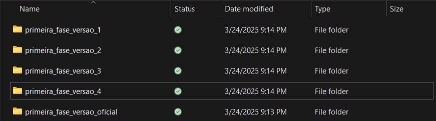

# Importância e usos do git

Para usar uma ferramenta, precisamos antes entender a utilidade dela. E para entender o git, esse próprio repositório vai nos ajudar. Vamos pensar em duas realidades, uma em que crio esse projeto com e sem git.

## Sem git
Desde que comecei esse repositório, já idealizei umas 4 versões do que ele deveria ser, e a estrutura dele pra ajudar os alunos da melhor forma possível. Já criei arquivos e pastas e apaguei eles 5 minutos depois. Vamos visualizar isso no explorador de arquivos:



Agora pense quão difícil é lembrar o conteúdo de cada uma dessas pastas. E nem estamos falando do histórico de versões de cada uma delas. Suponha que a pasta ```primeira_fase_versao_4``` tivesse 10 versões, por exemplo. Se tornaria completamente impráticavel fazer o gerenciamento de cada uma delas. Além de tudo isso, se trata de um projeto onde apenas UMA PESSOA está contribuindo (por ora). Imagine a complexidade de adicionar mais um agente como um outro monitor e/ou vários alunos?

Caso alguém quisesse contribuir no projeto, ela precisaria:
1. Receber o projeto via WhatsApp, e-mail, Pendrive, etc
2. Ler ele inteiro
3. Me mandar de volta o que ele(a) acredita ser uma versão melhor

Por minha vez, eu precisaria:
1. Ler todas as alterações da pessoa
2. Comparar com o meu projeto atual
3. Efetivamente aplicar as alterações propostas pela pessoa
4. Manter um histórico das alterações propostas

É fácil de perceber quão absurdo é esse fluxo de trabalho. É exaustivo simplesmente escrever sobre ele.

Agora:

## Com git


