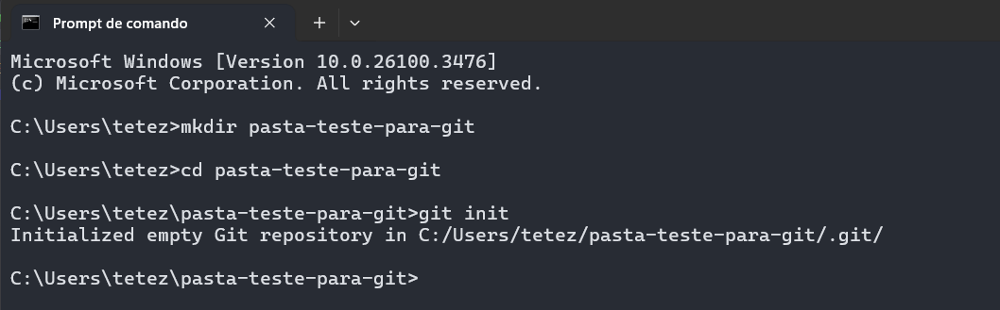

# Criação de um repositório local

No CMD do Windows, Terminal do Mac ou qualquer variação de terminal da sua distro Linux, execute os seguintes comandos:

1. ```mkdir pasta-para-testes-git``` # Criação de uma pasta para servir como repositório local
2. ```cd pasta-para-testes-git``` # O comando cd navega até a pasta especificada
3. ```git init``` # Esse comando efetivamente torna a pasta um repositório LOCAL



Com esses três comandos criados, podemos começar a utilizar o git na ```pasta-para-testes-git```
