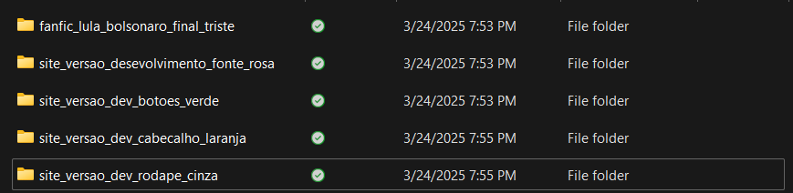

# Primeira fase - Sistemas de Informação - UNIPLAC

## Objetivo
Auxiliar os acadêmicos do curso de SI que estão tendo dificuldades com o git e seus conceitos e também fomentar a cultura de cooperação entre os alunos.

## O que essa primeira versão vai englobar
* O que é git
* Inicialização de um repositório (Remoto e Local)
* Comandos BÁSICOS
* Conceito de branches
* Conceito de Pull Requests

## O que é git
Git é uma ferramenta de controle de versão. Isso significa que ela pode nos ajudar a manter diversas versões de um software (ou outras coisas, como um livro, que pode ter diversos finais). Vamos pegar como exemplo um projeto web, onde temos uma série de alterações que devem ser feitas por múltiplos desenvolvedores:

Não é difícil de entender que seria difícil para um time de desenvolvimento se "localizar" nesse projeto. Cada uma dessas pastas pode ter facilmente alterações em 20 arquivos. E agora imagine que cada uma dessas alterações importa para a versão final, como podemos "juntar" elas em uma coisa só?

Com isso em mente, vamos ver como isso poderia funcionar em um repositório git.

No exemplo anterior, não falamos do conceito de repositório

